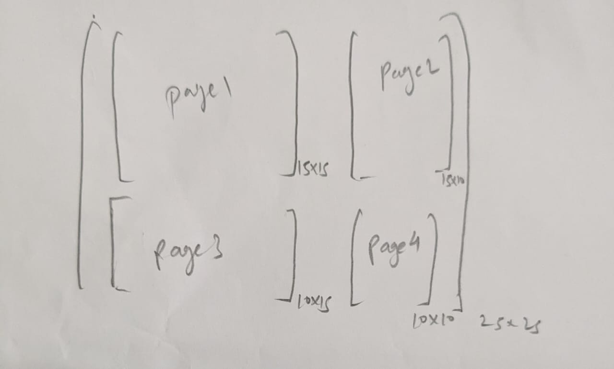
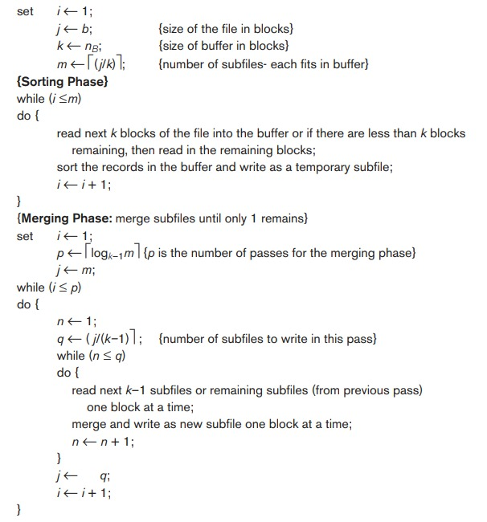

# Data Systems Project Phase 1

## Team

| Team member name | Roll number | Email ID |
| --- | --- | --- |
| Harshita Gupta | 2020101078 | harshita.gupta@students.iiit.ac.in |
| Naimeesh Narayan Tiwari | 2020101074 | naimeesh.tiwari@students.iiit.ac.in |
| Aarush Jain | 2020101016 | aarush.jain@students.iiit.ac.in |

## Blocks accessed

The number of blocks read is updated in **getPage** only counting the case where the block is loaded into the main memory from disk i.e when the page is inserted into the pool.

The number of blocks written is updated in **writePage.**

In the case of matrices, for all commands other than TRANSPOSE, this number is more correctly the number of writes in the pages because we append rows one by one in separate pages while loading the matrix.

## Page Design

- For implementing the commands for matrices, we have saved matrices in the form of sub-matrices i.e. each sub-matrix is stored on a different page.
- The max number of rows in a submatrix is 15, so a page can contain a sub-matrix of a maximum of 15*15 dimensions.
- for example, in a 25*25 matrix:

## Error Handling

- The syntactic parser checks if the command entered is correct or not.
    - the command is flagged invalid if the query size is not 4 for the following executors:
        1. RENAME
    - the command is flagged invalid if the query size is not 3 for the following executors:
        1. LOAD
        2. PRINT
        3. EXPORT
        4. TRANSPOSE
    - the command is flagged invalid if the query size is not 2 for the following executors:
        1. CHECKSYMMETRY
        2. COMPUTE
- Syntactic parser also checks if the command type is valid or not. (executor type)
- The semantic parser checks whether such a Matrix exists in the Catalogue.

## LOAD MATRIX

1. Rows are picked from the CSV file (memory) one by one.
2. Each row is then divided based on which columns belong to which page (for example in the 25*25 matrix, the 15th column for row 1 belongs to Page 1 and the 16th column for row 1 belongs to Page 2.
3. Rows are appended to the pages to which they belong.

## PRINT MATRIX

1. To find the page number, use the submatrix index.
2. Go to that page and get the desired row.
3. Repeat this step for all pages containing parts of that row.
4. If the matrix is larger than 20 rows and 20 columns, only display the first 20 rows and 20 columns.

## EXPORT MATRIX

Similar to PRINT, this time we write to a file.

## RENAME MATRIX

We first rename the matrix in the catalogue. Then we rename the pages corresponding to the old matrix in the temp folder as well as in the buffer manager.

## TRANSPOSE MATRIX

The Logic here goes like this:

When you flip a big matrix, each smaller section within it also flips. These smaller sections switch places with their matching sections on the opposite side of the diagonal.

To make this happen, we access and flip each small section one by one using page numbers and the buffer pool, and then put them back on the other side of the diagonal.

## CHECKSYMMETRY

We iterate through the submatrices (stored in separate pages). The submatrix at (i, j) will be stored in page : **i * this->totalSubmatricesAcrossRow + j**

For submatrices along the diagonal (i == j) we check if each of them is symmetric.

For submatrices in the upper triangle (i>j) we check if it is equal to the transpose of the corresponding submatrix in the lower triangle.

If all these conditions are satisfied, we return **true**, else **false**.

## COMPUTE

We iterate through the submatrices in a similar way. For every submatrix, we subtract the transpose of the corresponding submatrix on the opposite side of the diagonal from it. We write this resultant matrix into a new page corresponding to the new matrix A_RESULT.

### Learnings

- Designing Pages
- Efficiently Managing Pages and Memory Access
- Matrix Transposition Using Sub-matrices
- Problem-Solving Skills

### Contributions

| Team member name | Contributions |
| --- | --- |
| Harshita Gupta | EXPORT, CHECKSYMMETRY, COMPUTE, Error handling |
| Naimeesh Narayan Tiwari | PRINT, TRANSPOSE, COMPUTE, Testing |
| Aarush Jain | blocks accessed, LOAD, RENAME, Report, Testing |

### Key Takeaways

- We utilized Github and VS Code Liveshare for collaboration.
- Our initial steps involved discussing and formulating the foundational mathematics necessary for page indexing, access, and other operations.
- Subsequently, we focused on translating these concepts into practical implementation.

# Data Systems Project Phase 2

## Commands Implemented
1. SORT
- syntax : SORT <relation_name> BY <column_name1, column_name2, column_name3, .. column_namek> IN <SortingStrategy1, ... SortingStrategyk>  
- we use separate methods for sorting and merging.  
- then we delete the temporarily stored files/tables and overwrite on the original table.  

2. ORDER BY
- syntax : R <- ORDER BY <column_name1, column_name2,..., column_namek> <ASC|DESC, ASC|DESC,..., ASC|DESC> ON <relation_name>  
- we order by the given column name to obtain a new sorted table named after the required name.  
- to order, we use external sort on one column (given column).  

3. JOIN
- syntax :  R <- JOIN <relation_name1>, <relation_name2> ON <column_name1> bin_op <column_name2>  
- initially the given tables are sorted to give us sorted tables.  
- then we compare there values on the given columns to check if a certain row should be added to the new table.   
- if the row has to be added, we combine rows from both the tables and the combined row is written into the new table.   
- at the end, the sorted tables are removed from the buffer and memory.  

4. GROUP BY : <new_table> <- GROUP BY <grouping_attribute> FROM <table_name> HAVING
<aggregate(attribute)> <bin_op> <attribute_value> RETURN <aggregate_func(attribute)>
- sorted the original table by the grouping attribute using external sort.  
- then we calculate which rows satisfy the aggregate condition.  
- we check this individually for all unique grouping attributes.  
- then if satisfied, new row is inserted in the new table with values : grouping attribute and aggregate function 2 on attribute.  

## External Sort Algorithm

The external sort algorithm is broadly divided into two phases:   
    1. Sorting Phase  
        - k blocks are taken at a time and sorted internally, where k = BUFFER SIZE  
        - this creates sf different **sequences of sorted blocks** (called subfiles)   
    2. Merging Phase  
        - now we will merge k-1 sorted sequences i.e subfiles at a time (at each merge step) except for the last step where number of subfiles might be less than k-1.  
        - define merge_factor = k-1  
        - therefore total phases = log_(k-1)(sf)  
        - in each phase, we have ceil(sf_p/(k-1)) steps where sf_p = number of subfile at phase p  
        - we merge the blocks using a heap  
        - the algorithm stops when we reach the end of table   

- For implementation purposes to read the first block of a sorted subfile, we have used an array of k-1 block pointers one for each subfile which are going to be merged at the particular step.
- we have used custom comparator function and heap for sorting purposes.
- we store the newly sorted subfiles a temporary storage
- eventually we delete the temporary stored files and overwrite the values on the original space.

## Usage of External Sort For Other Commands
- SORT -> it is based on external sort and then we overwrite on the original table
- JOIN -> tables are sorted by the given columns and then joined
- ORDER BY -> table is sorted by the given column
- GROUP BY -> table is first sorted by the grouping attribute, required since aggregate has to be performed on unique values of grouping attribute.  

## Assumptions
1. Size of a record is less than or equal to block size
2. values are always integer
3. there will be no commas in the values
4. test cases provided for JOIN and GROUP BY will give atleast one row.

## Learnings
- external sort algorithm and its implementation
- handling pointers
- implementing JOIN, GROUP BY and ORDER BY

## Contribution

| Team member name | Contributions |
| --- | --- |
| Harshita Gupta | SORT, GROUP BY, Testing & Error Handling |
| Naimeesh Narayan Tiwari | SORT, JOIN, Testing & Error Handling |
| Aarush Jain | ORDER BY, Testing & Error Handling, Report|

